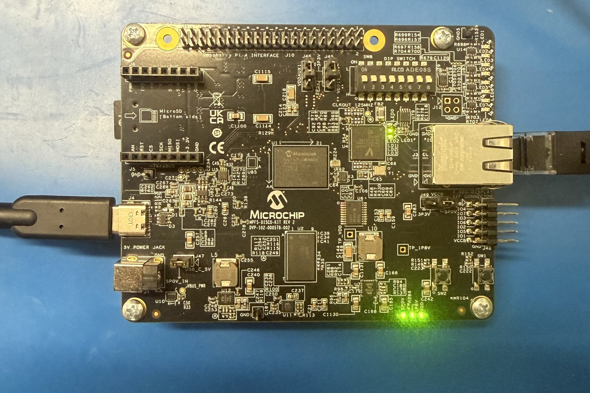
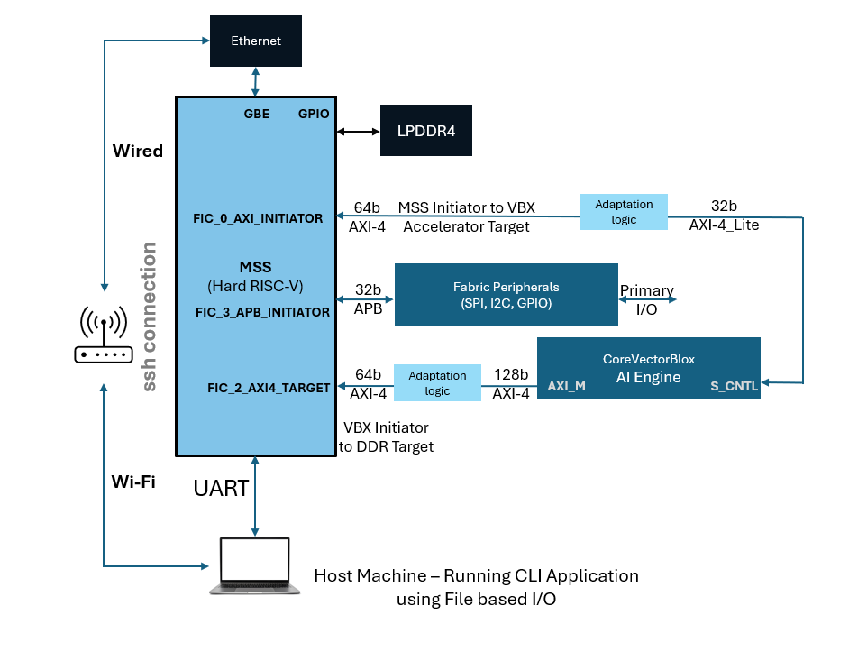

# PolarFire&reg; SoC Discovery Kit VectorBlox 3.1.1 Reference Design

This repository contains a simple reference design for running VectorBlox on the Discovery Kit.  

Using a model binary (.vnnx) compiled with the VectorBlox SDK, you can run inference on an input image directly on the Discovery Kit. The design can also be extended for other VectorBlox tasks.

#### Image of the Discovery Kit Running VectorBlox

> **Reference Image:**  When set up correctly, LEDs 1 and 2 should blink.

#### VectorBlox Discovery Kit Hardware Reference Design Overview

## Getting Started with VectorBlox on the Discovery Kit

Please refer to the **[Discovery Kit Getting Started Guide](./docs/getting_started_guide.md)** to install the VectorBlox reference design on the Discovery Kit.

## Useful References

- [PolarFire SoC Discovery Kit Reference Design](https://github.com/polarfire-soc/polarfire-soc-discovery-kit-reference-design) — The upstream Libero SoC Tcl reference design from which this VectorBlox design is derived. Useful for users who wish to add additional peripherals.
- [Discovery Kit Quickstart Guide](https://www.microchip.com/content/dam/mchp/documents/FPGA/ProductDocuments/ProductBrief/50003565_MPFS-Disco-Kit_QuickStart_Guide.pdf) — Covers driver installation, board connection, power-up, and UART communication. **Disregard the DSP FIR Filter demonstration section**, which is not relevant to the VectorBlox setup.
- [VectorBlox SDK](https://github.com/Microchip-Vectorblox/VectorBlox-SDK) — Instructions for compiling models for target hardware.
- [VectorBlox Tutorials](https://github.com/Microchip-Vectorblox/VectorBlox-SDK/tree/master/tutorials) — Shell scripts for compiling popular pretrained models. To generate binaries compatible with the Discovery Kit, modify `vnnx_compile` to use `-s V500` instead of `-s V1000`. **Note: not all tutorials are supported on the Discovery Kit.**
- [Resource Utilization](https://github.com/Microchip-Vectorblox/VectorBlox-SDK/blob/master/docs/resource_utilization.md) - Refer to this for FPGA resource utilization numbers for the VBX core.
- [CoreVectorBlox IP Handbook](https://github.com/Microchip-Vectorblox/VectorBlox-SDK/blob/master/docs/CoreVectorBlox_IP_Handbook.pdf) - Please refer to the CoreVectorBlox IP Handbook PDF within the docs folder of our SDK for more information about the VectorBlox core.
- [manual_HSS_update](./docs/manual_HSS_update.md) - Provides information on manually updating HSS within Libero. Use this if changing the Yocto Linux image.
- [core_configuration](./docs/core_configuration.md) -  Provides information on changing the core configuration for smaller hardware sizes. This is useful when modifying the reference design.
- [dtso_configuration](./docs/dtso_configuration.md) - Provides guidance on configuring the device tree source overlay.

## Quick Notes

- The Discovery Kit's jumper settings are correct out of the box and do not need to be modified.
- Large networks are not currently supported due to limitations in the current Yocto image.

---
