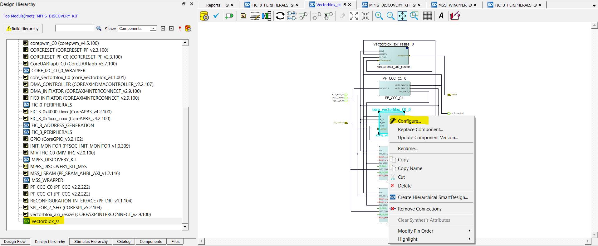
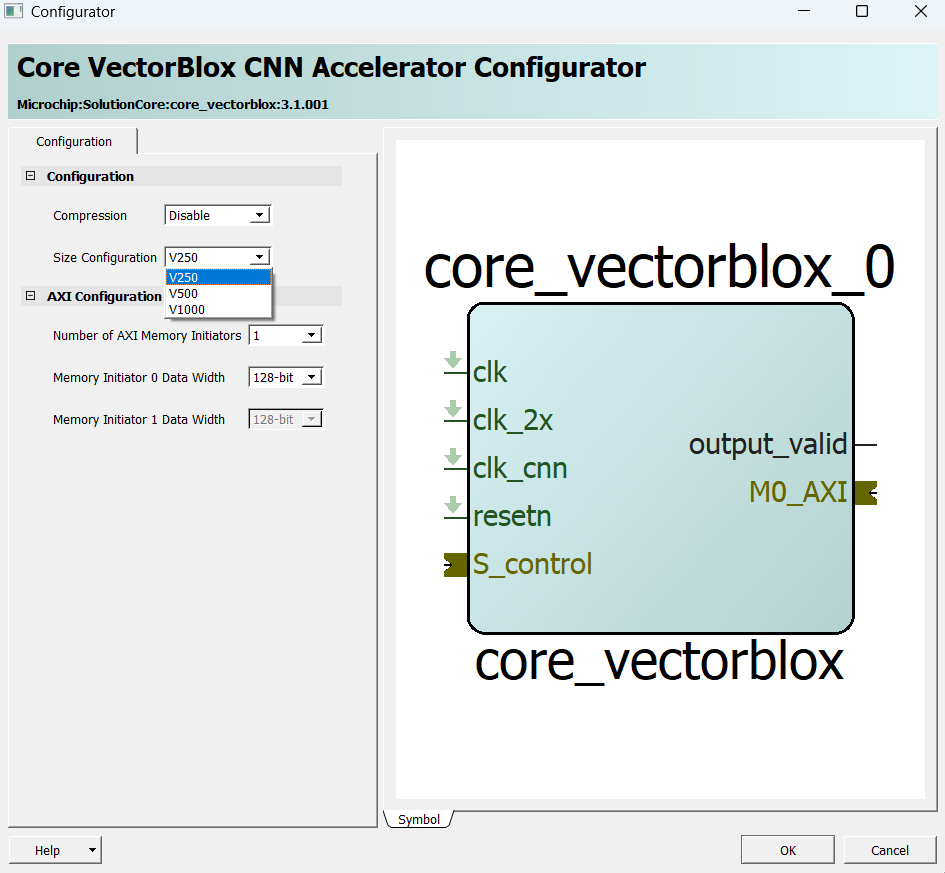

# Changing the VectorBlox core to V250 No Compression (optional)

The VectorBlox core can be changed to V250 No Compression, either in the Libero SoC SmartDesign or by editing the .tcl script. This is only needed when added hardware components must fit alongside the core on the FPGA — a smaller core trades FPGA area for increased model runtime. For even more information on core configuration, please visit the [IP Handbook](https://github.com/Microchip-Vectorblox/VectorBlox-SDK/blob/master/docs/CoreVectorBlox_IP_Handbook.pdf).

## Option A: Modify TCL Script for V250 Before Executing TCL

To modify the script, replace the contents of `script_support/additional_configurations/Vectorblox/components/core_vectorblox_C0.tcl` with the configuration below. Then run `MPFS_DISCOVERY_KIT_REFERENCE_DESIGN.tcl` using the `VECTORBLOX+HSS_UPDATE` arguments.

```tcl
# Exporting Component Description of core_vectorblox_C0 to TCL
# Family: PolarFireSoC
# Part Number: MPFS250T_ES-FCVG484E
# Create and Configure the core component core_vectorblox_C0
create_and_configure_core -core_vlnv {Microchip:SolutionCore:core_vectorblox:3.1.001} -component_name {core_vectorblox_C0} -params {\
"M0_AXI_DATA_WIDTH:128"  \
"M1_AXI_DATA_WIDTH:128"  \
"M_AXI_PORTS:1"  \
"PRESET:1"  \ # Set to 1 for V250 No Compression, or 2 for V500 No Compression
"SPARSITY:0"   }
```

## Option B: Libero SoC SmartDesign

To change the core configuration using the Libero SoC GUI, first run `MPFS_DISCOVERY_KIT_REFERENCE_DESIGN.tcl` with no arguments. After the Libero project is set up, follow these steps in SmartDesign to update the core configuration. For more information, see section 6 of the IP Handbook.


#### Open the Core VBX CNN Accelerator Configurator 



> **Reference Image**: Open the Design Hierarchy, then select VectorBlox_ss, then right-click on the VBX core and select Configure.

#### Set Hardware Size to V250



> **Reference Image**: This is also where compression can be selected if compiling compressed models with the SDK
