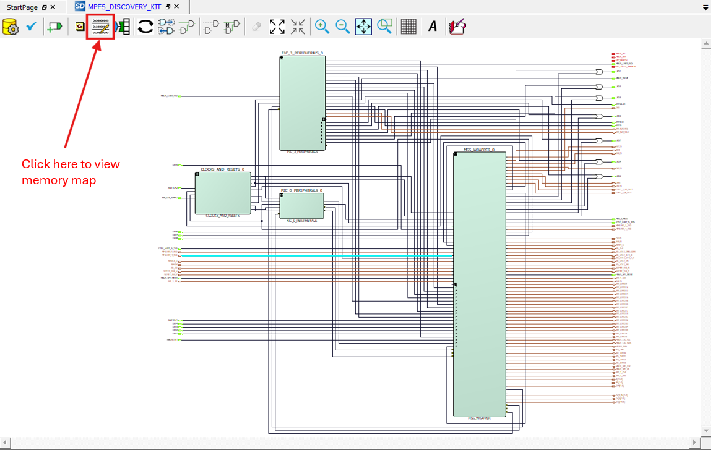
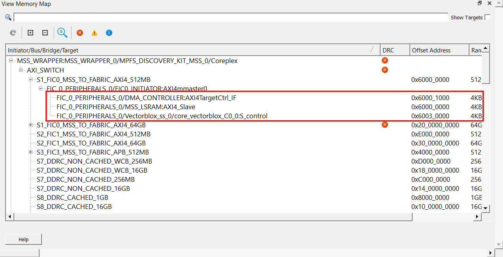

# Device Tree Source Overlay (.dtso) File Configuration  

The device tree source overlay informs Linux of a device’s location in the FPGA fabric and how to access it. When adding peripherals to the VectorBlox Discovery Kit Reference Design, use the memory map in Libero to identify the new peripheral’s address, then update the .dtso file with this address.

The device tree overlay file is located at `example/soc-c/dts/mpfs_vbx.dtso` in the VectorBlox SDK. 

> Note: When getting started with VectorBlox on the Discovery Kit, .dtso file configuration is not necessary.  

## Viewing Memory Map in Libero SoC  

Libero assigns an address to each hardware block, which is listed in the memory map. When adding peripherals, use this map to find the address to include in the .dtso file. For the Discovery Kit, only the VectorBlox core address at 0x60030000 is relevant. Ensure this address matches the one in the .dtso file (see images below).

### Where to Find Memory Map in Libero SoC  



>**Reference Image:** Where to click in Libero to view the memory map.

### Libero Memory Map for VectorBlox Discovery Kit Reference Design  



>**Reference Image:** This shows where the offset address of the VectorBlox core is located in memory. Make sure this address aligns with the core mapping in .dtso. The DRC errors can be ignored; they are related to unused logic and will not affect this reference design.

## mpfs_vbx.dtso for Discovery Kit Reference Design  

This design uses the `.dtso` file from the PolarFire SoC Video Kit Demo. Removing demo components is optional; the design functions correctly in either case.

The `compatible = "generic-uio";` line allows user-space programs, such as `run-model.cpp`, to access the VectorBlox core. Ensure the core address matches the value shown in Libero.

After modifying mpfs_vbx.dtso, run `make clean` and then `make overlay` in the `soc-c` directory on the Discovery Kit.

### mpfs_vbx.dtso File with Unused Peripherals Removed (optional step)  

```DTS
/dts-v1/;
/plugin/;
/ {
        fragment@0 {
                target-path="/";
                __overlay__ {
                        vbx@60030000 {
                                compatible = "generic-uio";
                                reg = <0x0 0x60030000 0x0 0x1000>;
                                interrupt-parent = <&plic>;
                                interrupts = <124>;
                                status = "okay";
                        };
                };
        };
};
```

> Note: Since the Discovery Kit Reference Design uses only the VectorBlox core, you may remove the other five devices to simplify the configuration.
