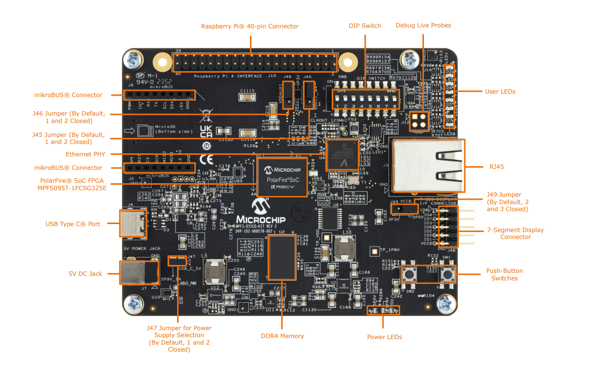
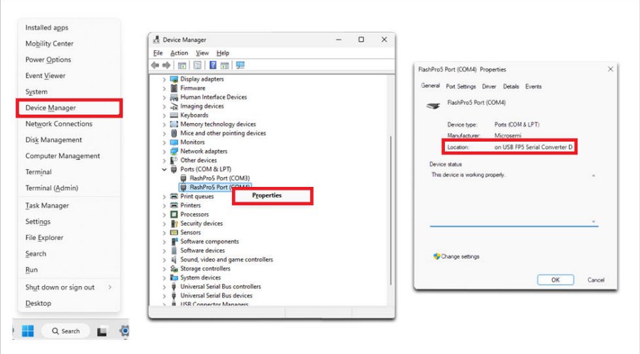
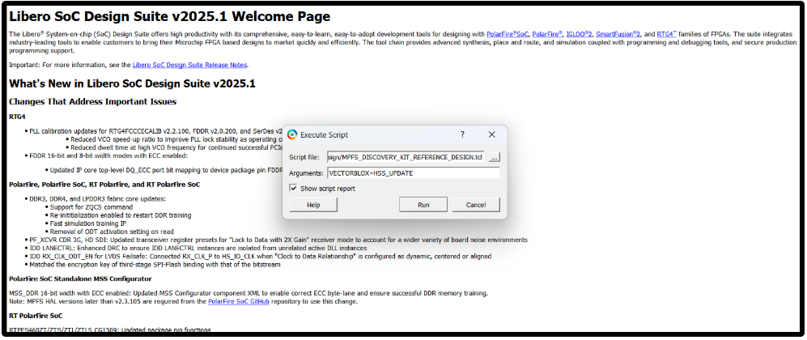
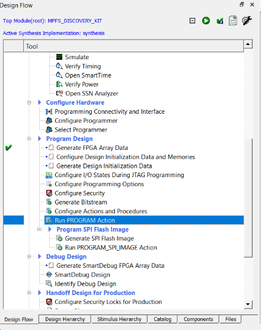
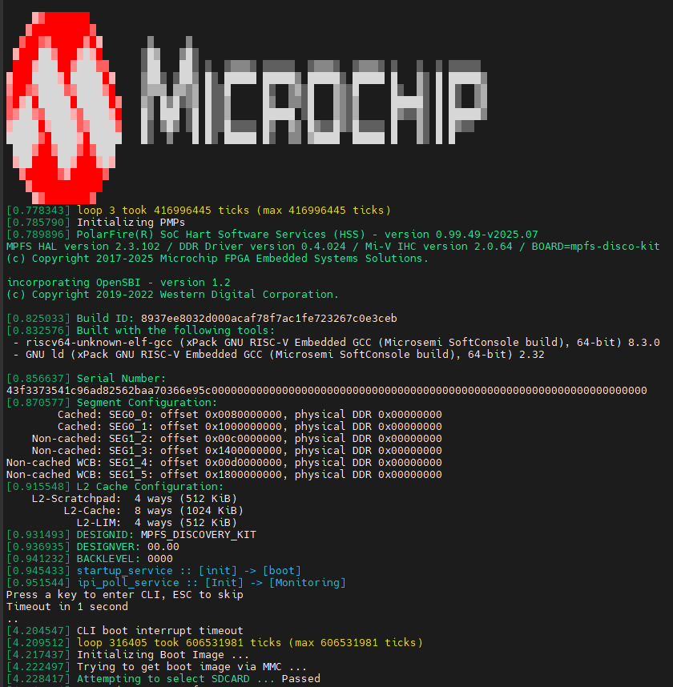
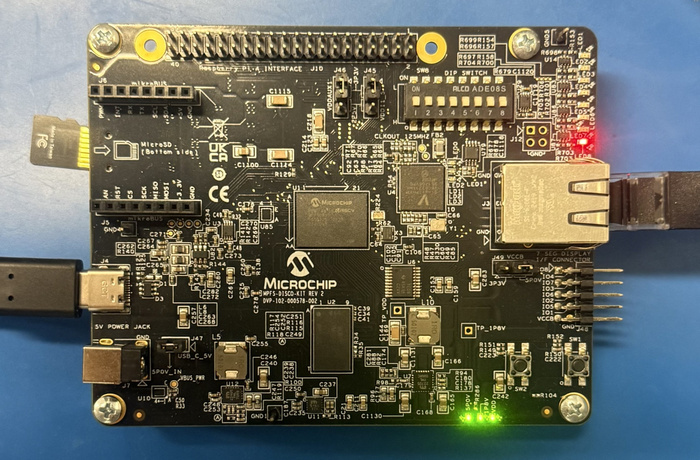
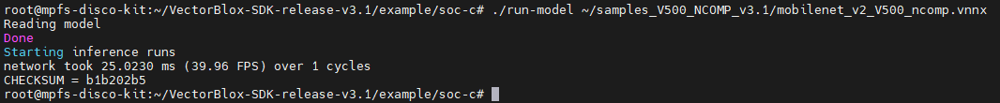
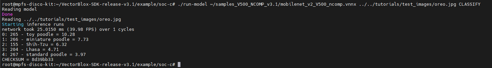

# VectorBlox 3.1.1 Discovery Kit Getting Started Guide

This guide offers step-by-step instructions for configuring the Discovery Kit for VectorBlox and running neural network inference on an image using a model compiled with the [VectorBlox SDK](https://github.com/Microchip-Vectorblox/VectorBlox-SDK).



>**Reference Image:** Top view of the Discovery Kit. Confirm that jumpers J45, J46, J47, and J49 are closed (default position). These are typically set correctly by default.

## Prerequisites

Before starting, **install the [FTDI Drivers](https://ftdichip.com/Drivers/) on your host PC and connect it to the Discovery Kit** using the included USB 2.0 Type-C cable. For driver installation details, refer to the driver section of the [Discovery Kit Quickstart Guide](https://www.microchip.com/content/dam/mchp/documents/FPGA/ProductDocuments/ProductBrief/50003565_MPFS-Disco-Kit_QuickStart_Guide.pdf).

<details>
<summary><b>FTDI Driver Installation Verification</b></summary>



>**Reference Image:** Confirm FTDI drivers are installed. Three COM ports should appear in Device Manager for this design.

</details>

<details>
<summary><b>Software Prerequisites</b></summary>
  
| Software | Purpose |
|----------|---------|
| [FlashPro Express](https://www.microchip.com/en-us/products/fpgas-and-plds/fpga-and-soc-design-tools/programming-and-debug#Download%20Software) | Required to program an FPGA bitstream to the Discovery Kit. Can be installed as a standalone tool; also included with Libero SoC. |
| [USBImager](https://bztsrc.gitlab.io/usbimager/) | Required to write a Linux image to the microSD card. |
| [Serial terminal](https://onlinedocs.microchip.com/oxy/GUID-E89F0380-CE10-4E39-B622-CA56F677F477-en-US-3/GUID-252CFF5A-1DB8-421F-B210-A5C575B68FE7.html) | For UART communication with the board (e.g., PuTTY or MobaXterm). |
| [FTDI drivers](https://ftdichip.com/Drivers/) | USB-to-UART drivers for the host PC. |
| [WinSCP](https://winscp.net/eng/download.php) | Recommended for transferring files (e.g., compiled `.vnnx` model binaries) to the Discovery Kit. The Linux `scp` command is a suitable alternative. |
| [Libero SoC](https://www.microchip.com/en-us/products/fpgas-and-plds/fpga-and-soc-design-tools/fpga/libero-software-later-versions) | Required only when building from source. Libero SoC v2025.2 is recommended; other versions should work but have not been tested. |
| [Libero SoC and CoreVectorBlox License](https://www.microchip.com/en-us/products/fpgas-and-plds/fpga-and-soc-design-tools/fpga/licensing) | The free Silver license is recommended for Libero SoC. A CoreVectorBlox license is required only when building from source in Libero SoC; it is not required when using the prebuilt job file. See the [Libero SoC License Installation Guide](https://ww1.microchip.com/downloads/aemDocuments/documents/FPGA/swdocs/libero/Libero_Installation_Licensing_Setup_User_Guide_2025_1.pdf) for help with license installation. |

</details>

<details>
<summary><b>Hardware Prerequisites</b></summary>
  
| Hardware | Purpose |
|----------|---------|
| [PolarFire® SoC Discovery Kit](https://www.microchip.com/en-us/development-tool/mpfs-disco-kit) | Product page for ordering the Discovery Kit. |
| MicroSD Card | This guide uses a Micro Center 32 GB Class 10 UHS-I U1 microSDHC card. |
| USB-C Memory Card Reader | Required if your host PC lacks a built-in microSD card slot. |
| Ethernet Cable | The Discovery Kit includes only a USB 2.0 Type-C cable. An Ethernet cable is required to download the SDK from GitHub in Step 3. |
| Ethernet Connectivity | Internet access via a connection to an IP gateway. |
  
</details>

---

## Step 1: Program the Discovery Kit with the VectorBlox Reference Design

This guide uses the VectorBlox 3.1 V500 No Compression core. Unless you plan to modify the hardware, use the provided job file. The `.tcl` scripts are preconfigured for VectorBlox 3.1 V500 No Compression.

<b>Option A: Use the Prebuilt Programming Job File</b>

A prebuilt `.job` file is included within the [release page](https://github.com/Microchip-Vectorblox/VectorBlox-Discovery-Kit-Reference-Design/releases) of this repository. Use FlashPro Express to program the Discovery Kit. Neither a Libero SoC installation nor a VectorBlox license is required for this option.

<b>Option B: Build from Source</b>

>Note: Building the Libero project from the TCL scripts may take some time. For core configuration details, see [core_configuration.md](./core_configuration.md).

1) Clone this repository on the host PC within the C drive:  

   ```bash
   git clone https://bitbucket.microchip.com/scm/fv/disco-kit-reference-design.git
   ```

2) Then open Libero SoC.  
3) Press `Ctrl+U` on the welcome page (or use the **Project** tab) to open the **Execute Script** window.  

   <details>
   <summary>Example Execute Script Window in Libero</summary>
  
   

   >**Reference Image:** Example Execute Script window configuration for VectorBlox.

   </details>

4) Select `MPFS_DISCOVERY_KIT_REFERENCE_DESIGN.tcl` as the script file and pass the following arguments:

   ```text
   VECTORBLOX+HSS_UPDATE
   ```
  
5) Click **Run** to start building the Libero SoC project. This process may take some time to complete.

   <details>
   <summary>Troubleshooting: "The command 'configure_envm' failed" when updating the HSS while building</summary>

   You might encounter this error when updating the Hart Software Services (HSS):

   ```text
   Error: The command 'configure_envm' failed.
   Error: Failure when executing Tcl script. [ Line 551 ]
   Error: The Execute Script command failed.
   ```  

   If you do, please refer to [manual_HSS_update.md](./manual_HSS_update.md) for instructions on verifying in "Configure Design Initialization and Memories" that the HSS has been loaded into the eNVM.

   </details>

6) After timing is met, proceed to Run PROGRAM ACTION. Ensure the Discovery Kit is connected to the host PC.

   <details>
   <summary>Example Run_PROGRAM_ACTION in Libero</summary>
   

   >**Reference Image:** Where to click to program the FPGA in Libero. Once done, proceed to Step 2 to boot Linux from a microSD card.  
   </details>

---

## Step 2: Boot Linux

The Discovery Kit lacks an eMMC chip, so **Linux must be booted from a microSD card**.

<b>Ensure the UART Is Configured Correctly:</b>

A serial terminal (such as PuTTY or MobaXterm) is required to communicate with the Discovery Kit. For configuration and connection instructions, refer to [Setting up the serial terminal](https://onlinedocs.microchip.com/oxy/GUID-E89F0380-CE10-4E39-B622-CA56F677F477-en-US-3/GUID-252CFF5A-1DB8-421F-B210-A5C575B68FE7.html) in the PolarFire SoC Video Kit Quickstart. The same settings apply to the Discovery Kit.

<b>Select a Yocto Image:</b>

Yocto Linux images are available at the [meta-mchp releases page](https://github.com/linux4microchip/meta-mchp/releases).  

The v2024.09 image used for this guide is available at [meta-polarfire-soc-yocto-bsp v2024.09 release](https://github.com/polarfire-soc/meta-polarfire-soc-yocto-bsp/releases/download/v2024.09/core-image-minimal-dev-mpfs-disco-kit-20241010180946.rootfs.wic.gz).  

The v2025.03 Discovery Kit image is also compatible, but v2024.09 is recommended.

<b>Write the Image to the MicroSD Card:</b>

Write the downloaded `.wic.gz` image to the microSD card. Step-by-step instructions are available in the [SD card content update procedure](https://github.com/polarfire-soc/polarfire-soc-documentation/blob/master/reference-designs-fpga-and-development-kits/updating-linux-in-mpfs-kit.md#sd-card-content-update-procedure).

After writing the image to the microSD card:

1. Eject the microSD card from your computer.  
2. Insert it into the microSD card slot on the Discovery Kit.  
3. Connect the Discovery Kit to the host PC using the included USB 2.0 Type-C cable. Linux will boot automatically.

<details>
<summary>Successful Linux Boot Terminal Example</summary>



>**Reference Image:** UART display on a successful Linux boot. If unsuccessful, `Attempting to select SDCARD ...` shows `FAILED` instead of `Passed`.  

</details>

<details>
<summary>Discovery Kit LED 8 on Linux Boot Failure</summary>



>**Reference Image:** If Linux fails to boot, LED 8 will turn on. Power cycling the board may resolve the issue.

</details>

---

## Step 3: Download the VectorBlox 3.1.1 SDK to the Discovery Kit or Use disco-quickstart.sh

> **All commands in this step are run on the Discovery Kit** (via the serial terminal or SSH), not on the host PC.

Before proceeding, ensure the Discovery Kit is connected to the internet using Ethernet from the board to an IP gateway.

**Option A: Run the disco-quickstart.sh to Automatically Complete Steps 3-6**

>Note: The disco-quickstart.sh will take a while to run.

```bash
wget --no-check-certificate https://github.com/Microchip-Vectorblox/assets/releases/download/assets/disco-quickstart.sh
bash disco-quickstart.sh
```

**Option B: Download and Extract the SDK and Continue to Step 4**

```bash
wget --no-check-certificate https://github.com/Microchip-Vectorblox/VectorBlox-SDK/archive/refs/tags/release-v3.1.1.zip
unzip release-v3.1.1.zip
```

The SDK will be extracted to the `VectorBlox-SDK-release-v3.1.1/` directory.

---

## Step 4: Build and Install libjpeg On-Target

> **All commands in this step are run on the Discovery Kit.**

The Yocto Linux image does not include libjpeg, which is required for image input and post-processing with VectorBlox.

**Download, Build, and Install libjpeg:**

```bash
# Fetch and unpack the source
mkdir -p /tmp/build && cd /tmp/build
wget --no-check-certificate https://ijg.org/files/jpegsrc.v9e.tar.gz || wget --no-check-certificate https://ijg.org/files/jpegsrc.v9d.tar.gz
tar xf jpegsrc.v9*.tar.gz
cd jpeg-9*

# Configure, build, and install
./configure --prefix=/usr
make -j"$(nproc || echo 2)"
make install
```

**Verify the Installation:**

```bash
ls /usr/include/jpeglib.h
ls /usr/lib*/libjpeg.*
```

<details>
<summary>Expected Output</b></summary>

```bash
/usr/include/jpeglib.h

/usr/lib/libjpeg.a   /usr/lib/libjpeg.so    /usr/lib/libjpeg.so.9.5.0
/usr/lib/libjpeg.la  /usr/lib/libjpeg.so.9
```

</details>

---

## Step 5: Compile Networks with the VectorBlox 3.1.1 SDK

> **Important:** Models requiring more than 32 MB of contiguous DMA allocation will not run on the Discovery Kit. The current Yocto image limits allocations to 32 MB chunks (from approximately 128 MB of non-cached DMA). Use smaller models such as `mobilenet_v2`.

**Option A: Use Pre-Compiled samples_V500_NCOMP_3.1.1.zip**

> **All commands in Step 5 option A are run on the Discovery Kit.**

A precompiled `mobilenet_v2_V500_ncomp.vnnx` is included in the release assets of this repository within `samples_V500_NCOMP_3.1.1.zip`. Run the following commands on the Discovery Kit to download and extract `samples_V500_NCOMP_3.1.1` to the root directory.

```bash
wget --no-check-certificate https://github.com/Microchip-Vectorblox/VectorBlox-Discovery-Kit-Reference-Design/releases/download/release-v3.1.1/samples_V500_NCOMP_3.1.1.zip

unzip samples_V500_NCOMP_3.1.1.zip
```

**Option B: Compile Networks with the VectorBlox 3.1.1 SDK**

1. On a host PC with the VectorBlox 3.1.1 SDK installed, compile a network using the `V500` and `ncomp` arguments (for example, `tensorflow/mobilenet_v2`). This will generate a `.vnnx` file. For more information, see the [VectorBlox SDK](https://github.com/Microchip-Vectorblox/VectorBlox-SDK).
2. Find the IP address of the Discovery Kit over UART terminal with the 'ifconfig' command
3. Transfer the `.vnnx` file to the Discovery Kit, placing it in a folder such as `~/samples_V500_NCOMP_3.1.1/` using WinSCP or `scp` using the board IP address.

Example `scp` command to transfer compiled model from SDK to Discovery Kit:

```bash
scp samples_V500_NCOMP_3.1.1/mobilenet_v2_V500_ncomp.vnnx root@BOARD_IP:/home/root/samples_V500_NCOMP_3.1.1
```

---

## Step 6: Run Models on the Discovery Kit

> **All commands in this step are run on the Discovery Kit.**

**Navigate to the `soc-c` Directory and Build the Application as Follows:**

```bash
cd VectorBlox-SDK-release-v3.1.1/example/soc-c
make clean
make kit=discovery
make overlay
```

**Run with Test Data (No Post-Processing):**

```bash
./run-model ~/samples_V500_NCOMP_3.1.1/mobilenet_v2_V500_ncomp.vnnx
```

<details>
<summary>Expected Output</summary>



</details>

**Run with an Image and Classification Post-Processing:**

```bash
./run-model ~/samples_V500_NCOMP_3.1.1/mobilenet_v2_V500_ncomp.vnnx ../../tutorials/test_images/oreo.jpg CLASSIFY
```

<details>
<summary>Expected Output</summary>

</details>

<br>

>Note: When adding new components to this reference design, update the .dtso file accordingly. For details on the device tree source overlay, see [dtso_configuration.md](./dtso_configuration.md).

---

## Next Steps

Next, you may wish to:

- Experiment with different models from the [VectorBlox Tutorials page](https://github.com/Microchip-Vectorblox/VectorBlox-SDK/tree/master/tutorials).
- Compile and run your own custom model.
- Replace the test input image with a live feed from an SPI camera.
- Output inference results to a peripheral display.
