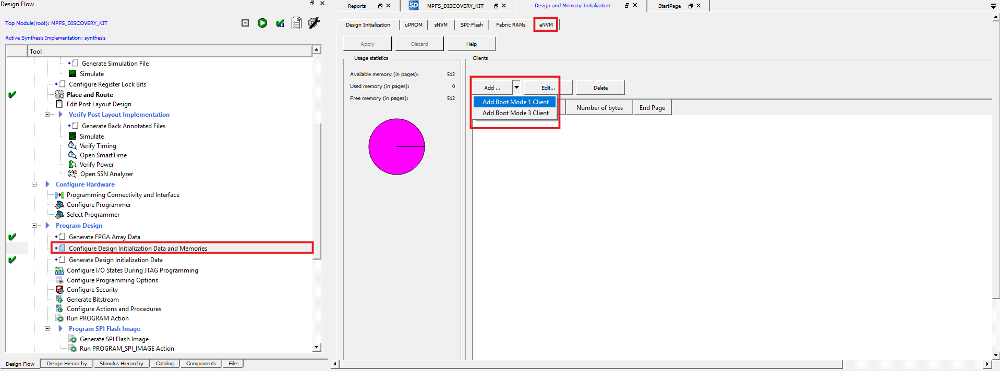

# Manual HSS Update within Libero

This document provides instructions for manually updating Hart Software Services (HSS) within Libero for the Discovery Kit.

The HSS performs boot and system monitoring functions for the PolarFire SoC. Without the HSS, the Discovery Kit cannot boot Linux from the microSD card.

#### How to Update the HSS Manually within Libero

> **Reference Image**: Notice that "Used memory (in pages)" is 0 meaning the HSS is not loaded within the eNVM. In this case, follow the preceding steps to manually update the HSS within Libero.

To set the PolarFire SoC boot mode to 1 and program an eNVM client in Libero:

1) Run the Libero SoC design flow so that "Generate FPGA Array Data" has completed and open the "Configure Design Initialization Data and Memories" tool
2) Select the "eNVM" tab
3) Select the "Add ..." option and select "Add Boot Mode 1" client
4) Navigate to the binary file to be used as a client and select ok
5) Select the Apply button
6) Run the remainder of the Libero SoC design flow and program the device